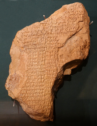

# AkkadianOracle

 [1]

Have you ever visited a museum with an ancient people's exhibit? Surely you've seen the various artifacts that are available. But have you ever stopped to wonder how those people from thousands of years ago really saw the world? It's been impossible to try to even get a sense without being a historian or directly involved in that field- or at least, until now!

AkkadianOracle lets you talk to someone from 3000 years ago who lives in Ancient Mesopotamia and now magically speaks English and can communicate with you across time. This is your chance to better understand how Akkadians viewed the world and how their common sense understanding differs from ours.

You can try out the totally free version (requires a free Poe account) based on ChatGPT here:  
https://poe.com/AkkadianOracle

Optionally, there is a version for Poe subscribers based on GPT-4 here:  
https://poe.com/AkkadianArchon

## Sample Chats
Here are some particularly insightful conversations we've already had:

- Crime and Punishment: https://poe.com/s/5qSftTCZoQysXUjQw0vh
- Morality and Virtuousness: https://poe.com/s/9LwPZWpbsSM7WPw9jMHl
- Labor and Organization of Society: https://poe.com/s/x56WImkBveeOD09JUqgE

Please send over any that you had that you found useful or interesting!

## Project Goal
The overall goal of this project is to create realistic chatbots that can communicate as if they are someone with the latent knowledge, sensibilities, and culture all imbued within the textual corpus of an ancient language. AkkadianOracle is an example using a corpus of Akkadian from the Neo-Assyrian period. 

Some potential concrete use cases are:

1. To supplement an existing museum's ancient people's exhibit with a deeper, interactive window into the past.
2. To accelerate onboarding of new researchers into a particular historical time period.
3. To be a companion to field test new epistemological theories related to a particular time period.

## Implementation Details
**AkkadianOracle** is a chatbot built using the Poe platform on top of ChatGPT and GPT-4 with Retrieval-Augmented Generation (RAG) with my released [Akkadian English corpus](https://huggingface.co/datasets/veezbo/akkadian_english_corpus) [2].

In this repo, these are the relevant files and their descriptions:
- `main.py` is the app code that can be deployed to Modal using `modal deploy main.py`
- `akkadian_talker_bot.py` implements the methods required by the [Poe Fastapi protocol](https://github.com/poe-platform/fastapi_poe)
- `corpus.py` loads the HuggingFace dataset into memory, and additionally implements the retrieval part of RAG, retrieving the most relevant sentences from the corpus based on the user's question
- `prompt.py` assembles the prompt for the LLM based on the relevant context and user question

## Alternative Approaches
The RAG-based approach used for AkkadianOracle has produced the best results so far. An alternative approach which has not worked so well is attempting to fine-tune smaller LLMs using the same corpus. This fine-tuning was attempted both on all paramters, and with [PEFT](https://github.com/huggingface/peft) [5]. The notebooks for both are shared in this repo.

It is not known whether PEFTing big LLMs (say, at the scale of ChatGPT) will work. It seems plausible it would, but it is rather difficult to test due to the scale.

It is likely that full-parameter fine-tuning of big LLMs would work, provided the learning rate is picked appropriately, simply due to the fact that this would be roughly equivalent to continuing training of the original model. However, this would require an inordinate amount of resources.

## Future Work
Future work will involve field-testing these bots on their performance. Assyriologists can help provide qualitative feedback (on tone, conversability, and usefulness in research), and we can measure quantiative results by re-purposing/building examinations on the Neo-Assyrian period these bots are trained on.

Because LLMs are motivated liars, it is also important to require citations for at least the falsifiable claims that are made. As a first step, we could adjust the prompt so that relevant citations from the RAG context are provided.

## References
[1] Daderot, CC0, via Wikimedia Commons, https://commons.wikimedia.org/wiki/File:Tablet_describing_goddess_Inanna%27s_battle_with_the_mountain_Ebih,_Sumerian_-_Oriental_Institute_Museum,_University_of_Chicago_-_DSC07117.JPG

[2] Vibhor Kumar, Akkadian English Corpus, HuggingFace, Sept 2023, https://huggingface.co/datasets/veezbo/akkadian_english_corpus

[3] Gai Gutherz, Shai Gordin, Luis Sáenz, Omer Levy, Jonathan Berant, Translating Akkadian to English with neural machine translation, PNAS Nexus, Volume 2, Issue 5, May 2023, pgad096, https://doi.org/10.1093/pnasnexus/pgad096

[4] Jamie Novotny, Eleanor Robson, Steve Tinney, Niek Veldhuis, et al. Open Richly Annotated Cuneiform Corpus, http://oracc.org

[5] Sourab Mangrulkar, Sylvain Gugger, Lysandre Debut, Younes Belkada, Sayak Paul, Benjamin Bossan, PEFT: State-of-the-art Parameter-Efficient Fine-Tuning methods}, 2022, https://github.com/huggingface/peft
